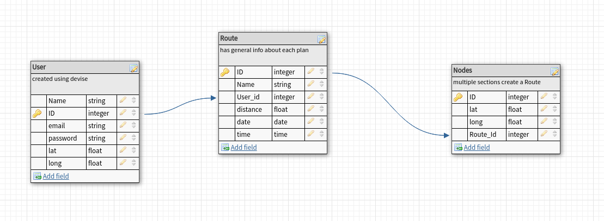
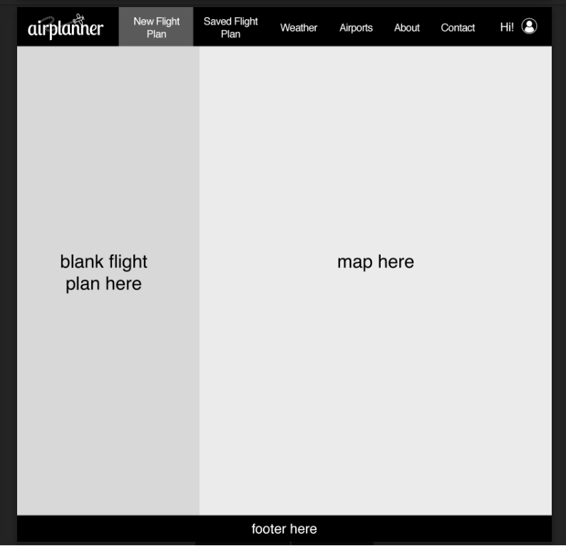
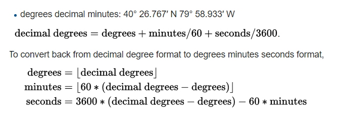
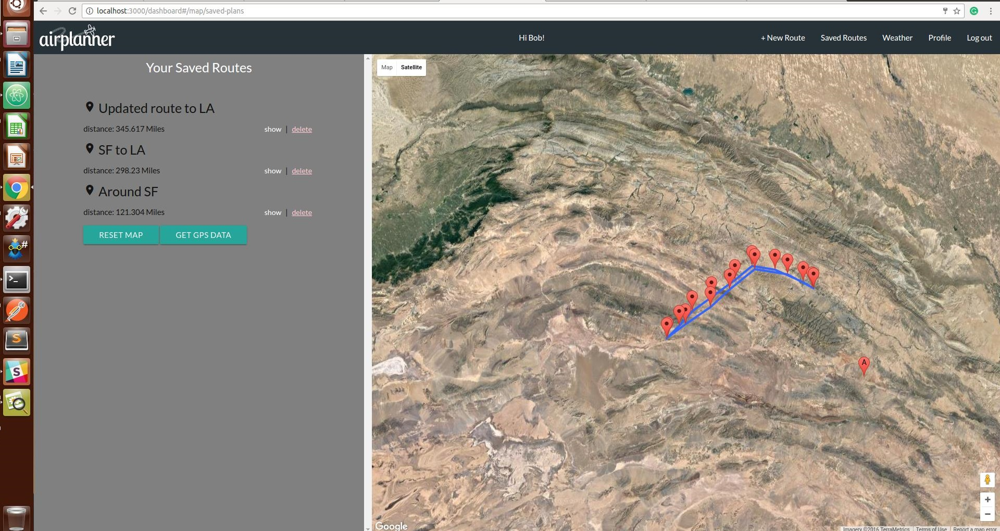
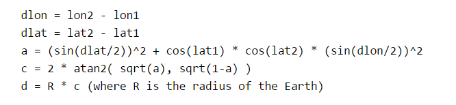

  

AirPlanned is a SAP for planning flights.This application is created for planning short distance flights and provide details about the route you have in mind by using Google Maps API.

I worked with UXUI designer(Revy Samia) to create UI. So far, the first sprint is completed and there are few user stories that are not fully available (mentioned below).

you can find the application here:
[heroku link](https://airplanner.herokuapp.com/users/sign_in)

### Technilogies:
- HTML/CSS
- AngularJS
- Google Maps API
- Ruby on Rails
- Devise 
- PaperClip
- PostgreSQL

### project duration:
Nov 18 - Nov 29

### Data Models


*User model is created using devise, here the most important fielad are mentions.

### Wireframes:



Map is always fixed on the right section and using the navigation bar you can switch to different parts of the app.

### User Stories:
 Users can:
 - create use map to pick locations
 - see coodinates of the selected location
 - see the calculated distance between locations as they add new locations
 - see total distance
 - enter speed and see the time it takes to travell on(on way)
 - edit the route by deleting to adding new locations
 - save the route
 - view the saved routes list
 - the saved routes on the map is they click 'show' option
 - delete the saved route
 - see the weather forecast for a location they pick ( predications for the next 2days, every 3hrs)

Users will able to:
 - upload GPS data 
 - see the comparison between the saved route and GPS data (halfway done)
 
 
### GPS Data Sample file

Below is a small section of GPS data:
```
T  N36 35.8923 E059 11.2997 Sun Nov 13 10:33:52 2016 ;3873.411965;      1e25; SM;    0.0000;    0.0000;    0.0000;       INF;         -;|0.000000
T  N36 35.8743 E059 11.3151 Sun Nov 13 10:33:52 2016 ;3879.719732;      1e25; SM;    0.0252;    0.0252;    0.0252;       INF;         0;|0.000000
T  N36 35.8743 E059 11.3151 Sun Nov 13 10:33:52 2016 ;3822.949027;      1e25; SM;    0.0000;    0.0252;    0.0252;       INF;         0;|0.000000
T  N36 35.8743 E059 11.3151 Sun Nov 13 10:33:52 2016 ;3857.642146;      1e25; SM;    0.0000;    0.0252;    0.0252;       INF;         0;|0.000000
T  N36 35.8795 E059 11.3228 Sun Nov 13 10:33:52 2016 ;3856.065004;      1e25; SM;    0.0093;    0.0345;    0.0345;       INF;         0;|0.000000
T  N36 35.8833 E059 11.3254 Sun Nov 13 10:33:52 2016 ;3856.065004;      1e25; SM;    0.0050;    0.0395;    0.0395;       INF;         0;|0.000000
T  N36 35.8898 E059 11.3151 Sun Nov 13 10:33:52 2016 ;3856.065004;      1e25; SM;    0.0121;    0.0516;    0.0516;       INF;         0;|0.000000
T  N36 35.8898 E059 11.3151 Sun Nov 13 10:33:52 2016 ;3892.335266;      1e25; SM;    0.0000;    0.0516;    0.0516;       INF;         0;|0.000000
T  N36 35.8898 E059 11.3151 Sun Nov 13 10:33:52 2016 ;3857.642146;      1e25; SM;    0.0000;    0.0516;    0.0516;       INF;         0;|0.000000
T  N36 35.8885 E059 11.3550 Sun Nov 13 10:33:52 2016 ;3860.796430;      1e25; SM;    0.0369;    0.0885;    0.0885;       INF;         0;|0.000000
T  N36 35.8859 E059 11.3550 Sun Nov 13 10:33:52 2016 ;3859.219288;      1e25; SM;    0.0030;    0.0915;    0.0915;       INF;         0;|0.000000
T  N36 35.9271 E059 11.3216 Sun Nov 13 10:33:52 2016 ;3876.565448;      1e25; SM;    0.0566;    0.1481;    0.1481;       INF;         0;|0.000000
T  N36 35.9284 E059 11.3396 Sun Nov 13 10:33:52 2016 ;3868.680538;      1e25; SM;    0.0167;    0.1649;    0.1649;       INF;         0;|0.000000
T  N36 35.8743 E059 11.4168 Sun Nov 13 10:33:52 2016 ;3898.643033;      1e25; SM;    0.0948;    0.2596;    0.2596;       INF;         0;|0.000000
T  N36 35.8086 E059 11.5108 Sun Nov 13 10:33:52 2016 ;3892.335266;      1e25; SM;    0.1152;    0.3748;    0.3748;       INF;         0;|0.000000
T  N36 35.5254 E059 11.8932 Sun Nov 13 10:33:52 2016 ;4092.608274;      1e25; SM;    0.4810;    0.8558;    0.8558;       INF;         0;|0.000000
T  N36 35.4237 E059 12.0206 Sun Nov 13 10:33:52 2016 ;4133.608360;      1e25; SM;    0.1662;    1.0219;    1.0219;       INF;         0;|0.000000
T  N36 35.3645 E059 12.1030 Sun Nov 13 10:33:52 2016 ;4191.956207;      1e25; SM;    0.1023;    1.1242;    1.1242;       INF;         0;|0.000000
T  N36 35.2962 E059 12.2048 Sun Nov 13 10:33:52 2016 ;4228.226469;      1e25; SM;    0.1225;    1.2467;    1.2467;       INF;         0;|0.000000
T  N36 35.2074 E059 12.4107 Sun Nov 13 10:33:52 2016 ;4319.689493;      1e25; SM;    0.2162;    1.4630;    1.4630;       INF;         0;|0.000000
T  N36 35.2525 E059 12.5704 Sun Nov 13 10:33:52 2016 ;4352.805471;      1e25; SM;    0.1565;    1.6194;    1.6194;       INF;         0;|0.000000
T  N36 35.3104 E059 12.6283 Sun Nov 13 10:33:52 2016 ;4387.498590;      1e25; SM;    0.0856;    1.7050;    1.7050;       INF;         0;|0.000000
T  N36 35.4340 E059 12.6940 Sun Nov 13 10:33:53 2016 ;4415.883943;      1e25; SM;    0.1547;    1.8597;    1.8597;     249.0;         1;|0.000000
```

Using a function in Ruby, the file is paresed and the coordiantes are extracted. 
The format of the coordinates available in the data is h degree minute and what google maps work with is decimal. So they are converted and available to the as json. Conversion is done using:


Since there are too many samples in the file (about 450), the app will only pick one in every 30 sample and creates markers for the map based on the information.



#### Calculating distance between each marker:

